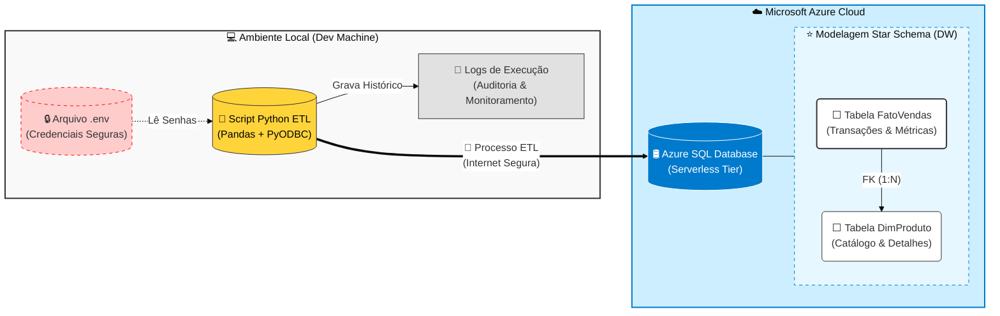
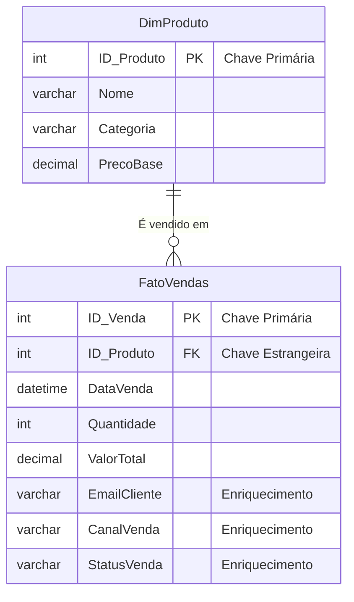
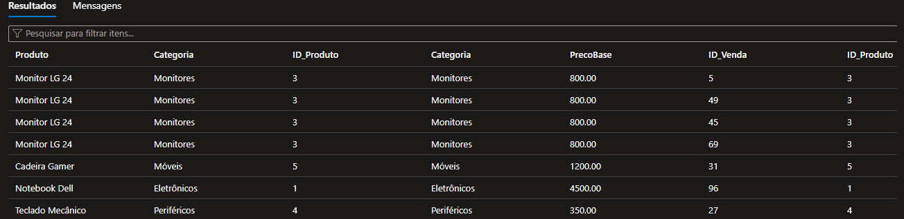

<div align="center">


</div>

# 🛒 Azure Retail Data Pipeline

Pipeline de Engenharia de Dados ETL (Extract, Transform, Load) que simula um ambiente de varejo, gerando dados transacionais e carregando-os em um Data Warehouse na nuvem (Azure SQL Database).

## ⚙️ Arquitetura da Solução

## 📋 Sobre o Projeto

Abaixo, o fluxo de dados desde a extração local até o carregamento no Azure:



Este projeto demonstra a criação de uma infraestrutura de dados moderna e segura. O script Python atua como um orquestrador que gera dados de vendas realistas (com regras de negócio), aplica modelagem dimensional (Star Schema) e carrega os dados no Azure.

### 🛠 Tecnologias Utilizadas
* **Linguagem:** Python 3.12
* **Cloud:** Microsoft Azure SQL Database (Serverless)
* **Bibliotecas:** Pandas (Transformação), PyODBC (Conector SQL), Python-Dotenv (Segurança), Logging (Observabilidade).
* **Modelagem:** Star Schema (Fato e Dimensão).

### ⭐ Modelagem de Dados (Star Schema)
Os dados foram modelados seguindo as melhores práticas de Data Warehousing (Kimball), separando Fatos (métricas) de Dimensões (contexto):



## ⚙️ Arquitetura e Funcionalidades

1.  **Segurança de Credenciais:** Uso de variáveis de ambiente (`.env`) para não expor senhas no código.
2.  **Modelagem Star Schema:**
    * `DimProduto`: Tabela dimensão com catálogo de produtos.
    * `FatoVendas`: Tabela fato com transações, chaves estrangeiras e métricas.
3.  **Enriquecimento de Dados:**
    * Simulação de **Canais de Venda** (App, Site, Loja Física).
    * Status do pedido (Aprovado, Cancelado, Pendente).
    * Geração de e-mails de clientes para CRM.
4.  **Logging e Monitoramento:** Geração automática de arquivos de log (`pipeline_vendas.log`) registrando cada etapa do processo ETL.

## 🚀 Como Executar

1.  Clone o repositório.
2.  Instale as dependências:
    ```bash
    pip install -r requirements.txt
    ```
3.  Crie um arquivo `.env` na raiz com suas credenciais do Azure:
    ```env
    AZURE_SERVER=seu-servidor.database.windows.net
    AZURE_DB=SeuBanco
    AZURE_USER=SeuUsuario
    AZURE_PWD=SuaSenha
    ```
4.  Execute o pipeline:
    ```bash
    python etl_completo_final.py
    ```

## 📊 Exemplo de Consulta (SQL)

Após a execução, é possível analisar os dados no Azure:

```sql
SELECT TOP 20
    P.Nome AS Produto,
    P.Categoria,
	P.ID_Produto,
    P.Categoria,
    P.PrecoBase,
    V.ID_Venda,
    V.ID_Produto,
    V.DataVenda,
    V.Quantidade,
    V.ValorTotal
FROM [dbo].[FatoVendas] V
JOIN [dbo].[DimProduto] P ON V.ID_Produto = P.ID_Produto
ORDER BY V.DataVenda DESC;

```

## 📊 Resultado da Consulta

